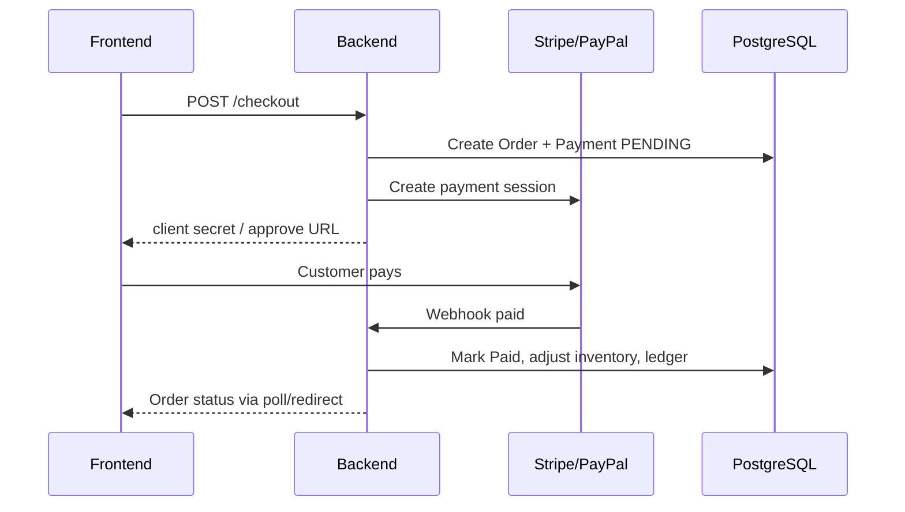

# GAME-MANIA — Integration Architecture

## Payment orchestration

### Idempotency

- Store provider event IDs
- Ignore duplicate webhooks safely
- Never decrement stock twice

## Media (Cloudinary)

- Admin requests signed upload params from API
- Browser uploads directly to Cloudinary
- API persists `ProductImage` metadata after confirm

## Email (Resend)

Transactional only in v1: welcome, reset password, order confirmation, shipping update, trade-in status.

## Analytics

- GA4 measurement ID on storefront only
- No PII in event payloads beyond allowed ecommerce fields
