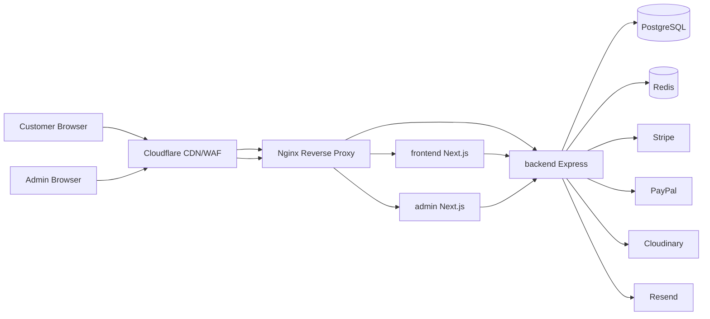
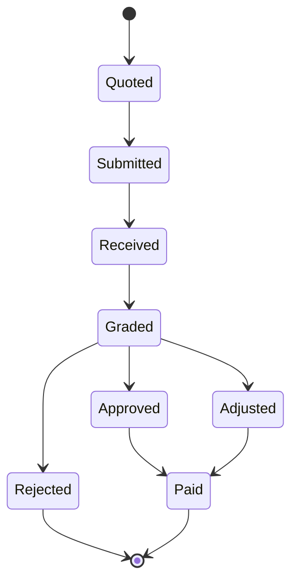

# GAME-MANIA — Architecture Overview

**Version:** 1.0.0  
**Market:** United Kingdom (GBP, en-GB)  
**Status:** Foundation

## 1. System context

GAME-MANIA is a UK gaming marketplace with three deployable applications and shared PostgreSQL data.



### Production hostnames

| Host | Service |
|------|---------|
| `gamemania.com` | Storefront |
| `admin.gamemania.com` | Admin dashboard |
| `api.gamemania.com` | REST API |

## 2. Application boundaries

| App | Responsibility | Port (dev) |
|-----|----------------|------------|
| `frontend` | Public catalog, cart, checkout, trade-in, account, blog, SEO | 3000 |
| `admin` | Catalog ops, orders, trade approval, CMS, RBAC, reports | 3001 |
| `backend` | Auth, business logic, payments, webhooks, notifications | 4000 |

Apps communicate **only** via the versioned REST API (`/api/v1`). No direct DB access from Next.js apps.

## 3. Backend clean architecture

```
HTTP Request
  → routes
  → middlewares (auth, rate-limit, validate)
  → controllers
  → services (domain rules)
  → repositories (Prisma)
  → PostgreSQL
```

Cross-cutting: `config`, `dto`, `validators` (Zod), `exceptions`, `utils`, structured `logs`.

### Module map

| Module | Domain |
|--------|--------|
| `auth` | Register, login, refresh, Google OAuth, password reset |
| `users` | Profiles, addresses, RBAC assignment |
| `catalog` | Products, categories, brands, images |
| `inventory` | Stock levels, reservations |
| `cart` / `orders` | Cart → checkout → fulfilment |
| `payments` | Stripe / PayPal, refunds, invoices, webhooks |
| `shipping` | Configurable rules (default free ≥ £60) |
| `trade-in` | Quote engine, requests, admin grading |
| `loyalty` | Reward points, store credit ledgers |
| `marketing` | Coupons, gift cards, offers |
| `reviews` | Product reviews moderation |
| `cms` | Pages, blogs, settings |
| `notifications` | In-app + email |
| `analytics` | Dashboard aggregates |
| `audit` | Admin action logs |

## 4. Frontend architecture

- **Next.js 15 App Router** with Server Components by default
- **SSR / ISR** for catalog and content; client islands for cart/checkout
- **Zustand** — cart, UI theme, ephemeral client state
- **TanStack Query** — server state, cache, mutations
- **React Hook Form + Zod** — forms
- **shadcn/ui + Tailwind** — design system
- **Framer Motion** — intentional motion (2–3 signature patterns)

Feature folders under `src/features/*` plus shared `components/`, `hooks/`, `lib/`.

## 5. Admin architecture

Separate Next.js app (same stack). Route groups for dashboard sections. All mutations require roles/permissions from JWT claims. No public SEO requirement.

## 6. Data & money

- All monetary amounts stored as **integer pence** (GBP)
- Shipping free threshold default: **6000** pence (£60)
- Flat shipping default: **395** pence (£3.95) — editable in Admin → Settings / Shipping Rules
- Soft deletes where audit history matters (`deletedAt`)

## 7. Auth & security

- Access JWT (short-lived) + refresh token (httpOnly secure cookie / rotating DB session)
- RBAC: `Role` ↔ `Permission` ↔ `User`
- Helmet, CORS allowlist, rate limiting, Zod validation, bcrypt passwords
- Prisma parameterized queries (SQLi mitigation)
- CSRF: SameSite cookies + double-submit / Origin checks on cookie-authenticated routes
- Webhook signature verification (Stripe / PayPal)

## 8. Trade-in bounded context



Quote from pricing rules (console → device → model → storage → condition → accessories). Payout: **cash** or **store credit** (credit may include configured uplift %).

## 9. Deployment topology

Docker Compose on Ubuntu VPS (Hostinger):

- `nginx` (TLS termination, reverse proxy)
- `frontend`, `admin`, `backend`
- `postgres`, `redis`
- Certbot / Let's Encrypt for SSL

Local: Docker for Postgres (+ Redis); apps via `npm run dev` on Windows host for fast DX.

## 10. Non-goals (v1)

- Multi-currency checkout UI (schema may reserve fields later)
- Native mobile apps
- Marketplace multi-vendor sellers (single merchant)

See [roadmap.md](./roadmap.md) for phased delivery.
