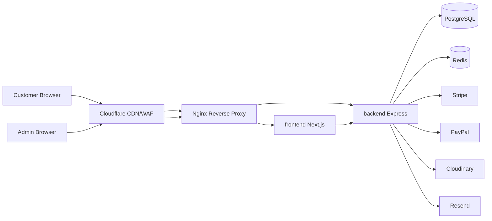
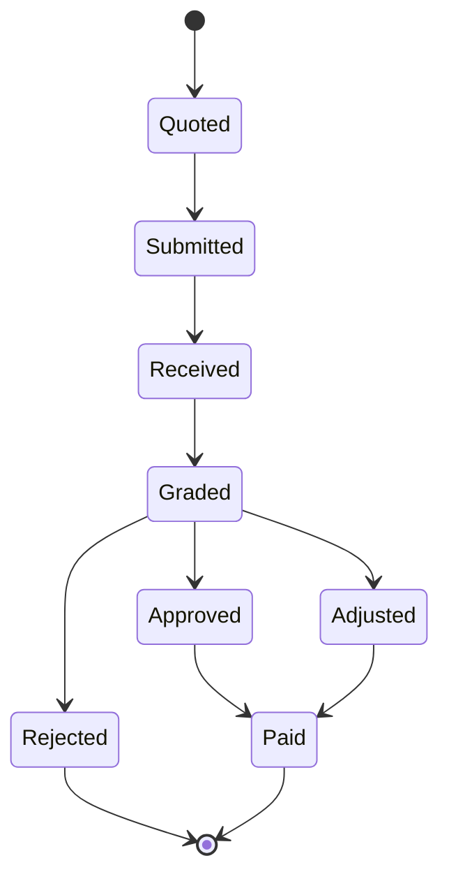

# GAME-MANIA — Architecture Overview

**Version:** 1.1.0  
**Market:** United Kingdom (GBP, en-GB)  
**Status:** System architecture baseline (Phase 3)

> Full design: [system-design.md](./system-design.md) · [auth-and-security.md](./auth-and-security.md) · [integrations.md](./integrations.md)

## 1. System context

GAME-MANIA is a UK gaming marketplace with one Next.js site (storefront + `/admin`) and a shared Express API on PostgreSQL.



### Production hostnames

| Host                 | Service                           |
| -------------------- | --------------------------------- |
| `YOUR_DOMAIN`        | Storefront + `/admin` staff panel |
| `YOUR_DOMAIN/api/v1` | REST API (Nginx → Express)        |

## 2. Application boundaries

| App        | Responsibility                                                               | Port (dev) |
| ---------- | ---------------------------------------------------------------------------- | ---------- |
| `frontend` | Public catalog, cart, checkout, trade-in, account, blog, SEO, staff `/admin` | 3000       |
| `backend`  | Auth, business logic, payments, webhooks, notifications                      | 5000       |

Apps communicate **only** via the versioned REST API (`/api/v1`). No direct DB access from Next.js.

## 3. Backend clean architecture

```
HTTP Request
  → routes
  → middlewares (auth, rate-limit, validate)
  → controllers
  → services (domain rules)
  → repositories (Prisma)
  → PostgreSQL
```

Cross-cutting: `config`, `dto`, `validators` (Zod), `exceptions`, `utils`, structured `logs`.

### Module map

| Module            | Domain                                                 |
| ----------------- | ------------------------------------------------------ |
| `auth`            | Register, login, refresh, Google OAuth, password reset |
| `users`           | Profiles, addresses, RBAC assignment                   |
| `catalog`         | Products, categories, brands, images                   |
| `inventory`       | Stock levels, reservations                             |
| `cart` / `orders` | Cart → checkout → fulfilment                           |
| `payments`        | Stripe / PayPal, refunds, invoices, webhooks           |
| `shipping`        | Configurable rules (default free ≥ £60)                |
| `trade-in`        | Quote engine, requests, admin grading                  |
| `loyalty`         | Reward points, store credit ledgers                    |
| `marketing`       | Coupons, gift cards, offers                            |
| `reviews`         | Product reviews moderation                             |
| `cms`             | Pages, blogs, settings                                 |
| `notifications`   | In-app + email                                         |
| `analytics`       | Dashboard aggregates                                   |
| `audit`           | Admin action logs                                      |

## 4. Frontend architecture

- **Next.js 15 App Router** with Server Components by default
- **SSR / ISR** for catalog and content; client islands for cart/checkout
- **Zustand** — cart, UI theme, ephemeral client state
- **TanStack Query** — server state, cache, mutations
- **React Hook Form + Zod** — forms
- **shadcn/ui + Tailwind** — design system
- **Framer Motion** — intentional motion (2–3 signature patterns)

Feature folders under `src/features/*` plus shared `components/`, `hooks/`, `lib/`.

## 5. Admin architecture

Staff UI is a route group inside `frontend` at `/admin` (same Next.js app). Access is limited to `STAFF` | `ADMIN` | `SUPER_ADMIN`; middleware keeps staff on `/admin` only. All mutations require roles/permissions from JWT claims. No public SEO (`robots: noindex`).

## 6. Data & money

- All monetary amounts stored as **integer pence** (GBP)
- Shipping free threshold default: **6000** pence (£60)
- Flat shipping default: **395** pence (£3.95) — editable in Admin → Settings / Shipping Rules
- Soft deletes where audit history matters (`deletedAt`)

## 7. Auth & security

- Access JWT (short-lived) + refresh token (httpOnly secure cookie / rotating DB session)
- RBAC: `Role` ↔ `Permission` ↔ `User`
- Helmet, CORS allowlist, rate limiting, Zod validation, bcrypt passwords
- Prisma parameterized queries (SQLi mitigation)
- CSRF: SameSite cookies + double-submit / Origin checks on cookie-authenticated routes
- Webhook signature verification (Stripe / PayPal)

## 8. Trade-in bounded context



Quote from pricing rules (console → device → model → storage → condition → accessories). Payout: **cash** or **store credit** (credit may include configured uplift %).

## 9. Deployment topology

Node.js + PM2 + Nginx on Ubuntu VPS (Hostinger — **no Docker**):

- Nginx (TLS termination, reverse proxy) — configs in `deploy/nginx/`
- PM2 processes: frontend (:3000, includes `/admin`), backend (:5000)
- Native PostgreSQL (+ optional Redis)
- Certbot / Let's Encrypt for SSL — `scripts/ssl/`

Local (Windows 11): native PostgreSQL; apps via `npm run dev` (ports 3000 / 5000).

## 10. Non-goals (v1)

- Multi-currency checkout UI (schema may reserve fields later)
- Native mobile apps
- Marketplace multi-vendor sellers (single merchant)

See [roadmap.md](./roadmap.md) for phased delivery.
