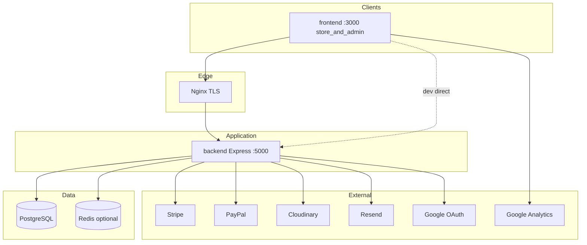
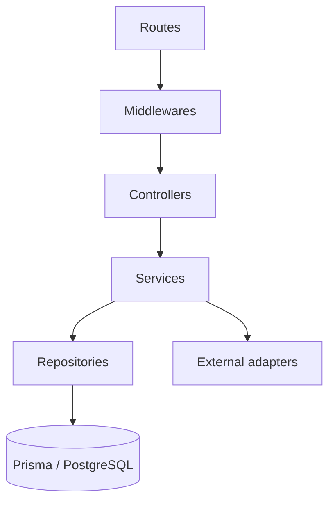
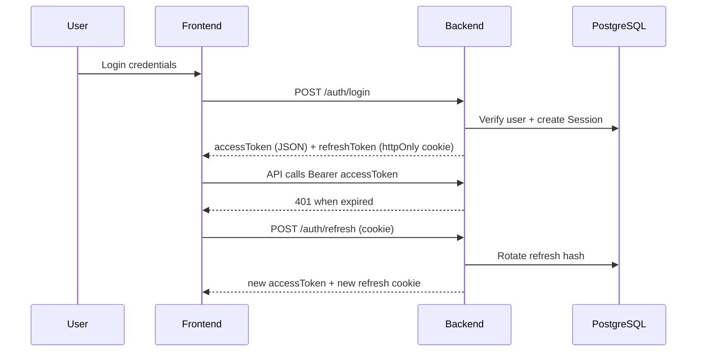
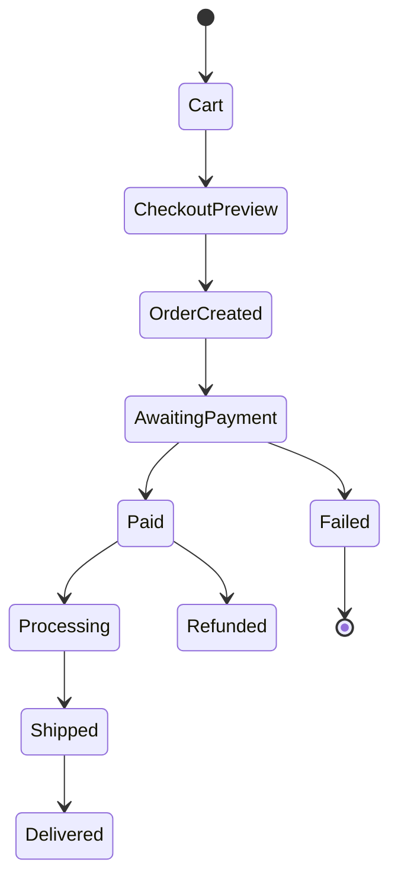
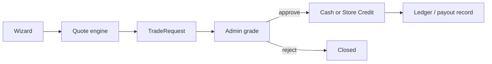

# GAME-MANIA — System Architecture (Phase 3)

**Version:** 1.1.0  
**Status:** Approved design baseline  
**Market:** United Kingdom (GBP / en-GB)  
**Runtime:** Windows 11 local · Ubuntu VPS production (no Docker)

This document is the engineering source of truth for how GAME-MANIA is structured, secured, and integrated. Implementation phases must follow these boundaries.

---

## 1. Goals & quality attributes

| Attribute       | Target                                                                           |
| --------------- | -------------------------------------------------------------------------------- |
| Scalability     | Stateless API; horizontal PM2/Nginx later; DB indexes for catalog/orders         |
| Security        | JWT + refresh rotation, RBAC, Helmet, CORS, rate limits, Zod, webhook signatures |
| Performance     | SSR/ISR storefront; image CDN; pagination; selective caching                     |
| Maintainability | Clean Architecture API; feature folders in Next apps; single Prisma schema       |
| Operability     | Native Postgres locally; PM2 + Nginx + Let's Encrypt in production               |
| UX              | Premium unique storefront; dark/light; accessible; fast perceived load           |

---

## 2. Logical architecture



**Hard rule:** Next.js never talks to PostgreSQL. All reads/writes go through `/api/v1`.

---

## 3. Application responsibilities

### 3.1 Storefront + staff panel (`frontend`)

- Public catalog, search, filters, product detail (SSR/ISR)
- Cart, checkout UI, wishlist, trade-in wizard
- Auth pages + customer dashboard
- Blog/CMS/marketing pages, SEO metadata, sitemap
- Staff `/admin` route group (RBAC; staff redirected away from storefront shopping UX)
- Client state: Zustand (cart/theme); server state: TanStack Query

### 3.2 API (`backend`)

- Auth, authorization, business rules, webhooks
- Clean Architecture layers (see §4)
- Idempotent payment webhook handling
- Audit logging for privileged actions

---

## 4. Backend Clean Architecture



| Layer             | Allowed to know              | Forbidden           |
| ----------------- | ---------------------------- | ------------------- |
| Routes            | path + middleware chain      | business rules      |
| Controllers       | HTTP mapping, status codes   | Prisma / SQL        |
| Services          | domain rules, transactions   | Express `req`/`res` |
| Repositories      | Prisma queries               | HTTP / cookies      |
| Validators / DTOs | Zod shapes, response mappers | side effects        |

Feature modules under `backend/src/modules/*` co-locate route wiring when a domain grows; shared infrastructure stays in `config`, `middlewares`, `utils`, `exceptions`.

---

## 5. Frontend / Admin architecture

```mermaid
flowchart LR
  APP[app router] --> FEAT[features/*]
  FEAT --> UI[components/ui]
  FEAT --> LIB[lib/api]
  LIB --> API[/api/v1]
  FEAT --> Z[Zustand]
  FEAT --> TQ[TanStack Query]
```

| Concern       | Choice                                                                           |
| ------------- | -------------------------------------------------------------------------------- |
| Routing       | Next.js App Router + route groups `(shop)`, `(auth)`, `(account)`, `(marketing)` |
| Forms         | React Hook Form + Zod                                                            |
| Styling       | Tailwind + shadcn/ui                                                             |
| Motion        | Framer Motion — 2–3 signature patterns, not noise                                |
| Theming       | `next-themes` dark/light                                                         |
| Data fetching | RSC for SEO pages; TanStack Query for interactive islands                        |

---

## 6. Auth & session design



### Rules

- Access JWT: short-lived (~15m), carries `sub`, `role`, `permissions[]`
- Refresh: opaque token, **hashed** in `Session`, httpOnly + Secure + SameSite
- Rotation on every refresh; reuse detection revokes family
- Google OAuth: create/link user by `googleId`, then same session model
- Password reset: single-use token, short TTL, emailed via Resend
- Admin uses same auth endpoints; UI gates on permissions

### RBAC

```
User → Role → RolePermission → Permission(code)
```

Examples: `products:read`, `products:write`, `orders:refund`, `trade-in:approve`, `settings:write`.

---

## 7. Commerce flow



1. Cart (guest `X-Guest-Id` or user) holds line items + inventory soft-check
2. `POST /checkout/preview` applies coupons, store credit, points, shipping quote
3. `POST /checkout` creates `Order` + `Payment` intent (Stripe/PayPal)
4. Webhooks mark payment success → decrement inventory → ledger rewards
5. Admin fulfils; customer tracks by `orderNumber`

**Money:** integer **pence** only. Display layer formats GBP.

**Shipping:** rule engine from `ShippingRule` (default: charge below £60, free at/above £60). Admin-editable; no hard-coded production thresholds.

---

## 8. Trade-in bounded context



Selection path: Console → Model → Storage → Condition → Accessories → automatic quote.  
Customer chooses **cash** or **store credit** (credit may apply configured uplift %).  
Admin can adjust after physical grading; all changes audited.

---

## 9. Integration architecture

| Service             | Direction             | Notes                                                   |
| ------------------- | --------------------- | ------------------------------------------------------- |
| Stripe              | Outbound + webhook in | PaymentIntents / Checkout; verify `Stripe-Signature`    |
| PayPal              | Outbound + webhook in | Orders v2; verify webhook cert/id                       |
| Cloudinary          | Outbound              | Signed uploads; store public IDs/URLs on `ProductImage` |
| Resend              | Outbound              | Order, auth, trade-in emails                            |
| Google OAuth        | Inbound redirect      | Callback on API host                                    |
| GA / Search Console | Frontend only         | Measurement ID via env                                  |

External adapters live behind thin service interfaces so providers can be mocked in tests.

---

## 10. Caching & performance

| Layer      | Strategy                                                                  |
| ---------- | ------------------------------------------------------------------------- |
| Storefront | ISR for category/product/blog; `revalidate` tags on admin publish         |
| API        | Optional Redis for rate-limit store + hot catalog fragments               |
| Images     | Cloudinary transforms + Next/Image                                        |
| DB         | Indexes on slug, status, orderNumber, foreign keys; pagination everywhere |
| Code       | App Router splitting; no unnecessary client bundles                       |

---

## 11. Security architecture

| Control   | Implementation                                 |
| --------- | ---------------------------------------------- |
| Transport | HTTPS in production (Let's Encrypt)            |
| Headers   | Helmet                                         |
| CORS      | Explicit origin allowlist (storefront + admin) |
| Input     | Zod on all write endpoints                     |
| AuthZ     | Permission checks in middleware                |
| Passwords | bcrypt (cost ≥ 12)                             |
| Cookies   | httpOnly, Secure, SameSite=Lax/Strict          |
| CSRF      | Origin/Referer check on cookie-auth routes     |
| SQLi      | Prisma only                                    |
| XSS       | React escaping + CSP-ready headers             |
| Abuse     | express-rate-limit (stricter on auth)          |
| Secrets   | env only; never in repo                        |
| Audit     | `AuditLog` for admin mutations                 |

---

## 12. Observability & ops

- Structured request logs with `requestId`
- `GET /api/v1/health` for uptime checks
- PM2 process logs under `logs/`
- DB backups via `scripts/deploy/backup-db.sh`
- No Docker in any environment

---

## 13. Environment matrix

|               | Frontend (+ `/admin`) | API                | Postgres     |
| ------------- | --------------------- | ------------------ | ------------ |
| Local Windows | :3000                 | :5000              | :5432 native |
| Production    | YOUR_DOMAIN           | YOUR_DOMAIN/api/v1 | VPS native   |

---

## 14. Architecture decision records

| ID      | Decision                             | Rationale                                            |
| ------- | ------------------------------------ | ---------------------------------------------------- |
| ADR-001 | Single Next.js app + Express API     | One website on KVM 1; staff `/admin` inside frontend |
| ADR-002 | No Docker                            | Matches Windows DX + Hostinger VPS ops preference    |
| ADR-003 | Money as integer pence               | Avoid float errors                                   |
| ADR-004 | Refresh sessions in DB               | Revocation + reuse detection                         |
| ADR-005 | Shipping rules in DB                 | Admin-configurable £60 threshold                     |
| ADR-006 | Feature folders + Clean Architecture | Long-term maintainability                            |
| ADR-007 | API owns all writes                  | Prevent split-brain business rules                   |

---

## 15. Phase alignment

| Workflow phase | Architecture deliverable        |
| -------------- | ------------------------------- |
| 3 (this doc)   | System design baseline          |
| 4–5            | Logical + Prisma physical model |
| 6              | REST contract freeze            |
| 9–15           | Implement against this design   |
| 18             | Production topology in §13      |

See also: [overview.md](./overview.md), [folder-structure.md](./folder-structure.md), [roadmap.md](./roadmap.md).
