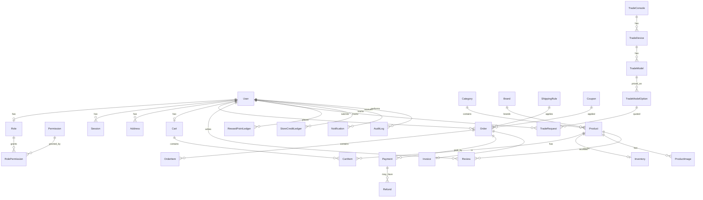

# Database Design

**Engine:** PostgreSQL 16  
**ORM:** Prisma  
**Schema path:** [`database/prisma/schema.prisma`](../../database/prisma/schema.prisma)  
**Money:** integer **pence** (GBP). Never use floating point for currency.

## Design principles

1. Single database shared by the API only.
2. Soft delete (`deletedAt`) on users and products.
3. Ledger tables for reward points and store credit (immutable append-only history).
4. Order line items snapshot SKU/name/price at purchase time.
5. Shipping rules are data-driven (not hard-coded), seeded with £60 free threshold.
6. Trade-in pricing is rule-based (`TradeModelOption` + accessory deltas).

## Entity groups

| Group | Models |
|-------|--------|
| Identity | User, Role, Permission, RolePermission, Session |
| Catalog | Category, Brand, Product, ProductImage, Inventory |
| Commerce | Cart, CartItem, Order, OrderItem, Payment, Refund, Invoice, ShippingRule |
| Promotions | Coupon, CouponRedemption, GiftCard |
| Social | Review, WishlistItem, Address |
| Trade-in | TradeConsole, TradeDevice, TradeModel, TradeModelOption, TradeAccessoryRule, TradeRequest |
| Loyalty | RewardPointLedger, StoreCreditLedger (+ denormalized balances on User) |
| Content | CmsPage, BlogPost, Setting, Notification, AuditLog |

## Shipping rule algorithm

Given order merchandise subtotal `S` (pence) and country `C`:

1. Select active rules where `country = C` and `minOrderAmount <= S` and (`maxOrderAmount` is null or `S <= maxOrderAmount`).
2. Pick highest `priority`; on tie, prefer lower `rate`.
3. Apply `rate` as `shippingTotal`.

**Seed defaults:**

| Rule | min | max | rate |
|------|-----|-----|------|
| Standard under £60 | 0 | 5999 | 395 (£3.95) |
| Free £60+ | 6000 | null | 0 |

Editable in Admin → Shipping Rules / Settings.

## ER diagram



See also [er-diagram.md](./er-diagram.md).

## Indexing strategy

- Unique: email, slug, sku, orderNumber, coupon code, gift card code
- Composite: wishlist (userId, productId), review (productId, userId)
- Query: order status + createdAt, product status + platform + price

## Migrations

```powershell
cd backend
npm run prisma:migrate
npm run prisma:seed
```

Schema lives in `database/prisma` so all apps reference one source of truth.
