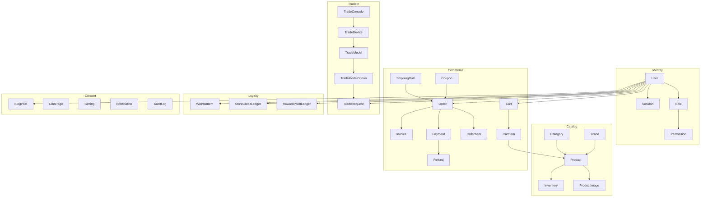

# ER Diagram (logical)

Full Prisma field-level detail: [`database/prisma/schema.prisma`](../../database/prisma/schema.prisma).

## High-level relationships

## Cardinality notes

| Relationship | Cardinality |
|--------------|-------------|
| User : Role | N : 1 |
| Product : Inventory | 1 : 1 |
| Order : Payment | 1 : N |
| User : TradeRequest | 1 : N |
| TradeModelOption : TradeRequest | 1 : N |
| Product : Review | 1 : N (unique per user) |
